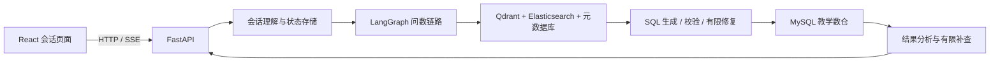

# 电商问数 Agent

基于 FastAPI、LangGraph 和 React 的自然语言数据分析项目。围绕电商教学数仓，完成元数据检索、SQL 生成与校验、多轮追问、结果分析和流式展示。

本仓库在 [didilili/shopkeeper-agent](https://github.com/didilili/shopkeeper-agent) 教程项目上继续开发，保留原作者 MIT 许可证。原项目来源和本版改动范围见 [UPSTREAM.md](UPSTREAM.md)，原教程介绍见 [存档 README](docs/upstream-readme.md)。

## 当前能力

| 部分 | 已实现 |
| --- | --- |
| 原始问数链路 | 字段/指标向量检索、字段值全文检索、元数据补全、SQL 生成、查询及 SSE 展示 |
| SQL 执行保护 | 语法树允许列表、表范围限制、EXPLAIN、最多两次修复且重新校验、结果和执行时间上限 |
| 多轮会话 | SQLite 持久化、追问理解、口径澄清、同会话执行互斥、不同会话独立状态 |
| 前端会话管理 | 切换会话时保留正在执行的请求和过程展示 |
| 结果分析 | 基于真实查询证据组织结论，最多两次补充查询，证据不足时返回部分结论 |
| 评测 | 可复现的合成数仓、冻结参考答案、复杂计算/澄清/分析/多轮场景，自动判分与人工复核分离 |

这不是通用多智能体系统；分析补查受现有数据、次数和时间预算约束。

## 验证记录

- 2026-09-20：93 项后端自动化测试通过，覆盖 SQL 校验与修复、会话状态、分析过程、数据版本和判分器。
- 数仓扩充到 2024—2025 年，9,840 笔合成订单；原始 2025 Q1 样例保留。
- 测试集原始规模为 46 个场景、63 轮输入；57 条参考查询和 18 条错误 SQL 变体均经过 SQLite / MySQL 核对。
- 尚未完成整套真实模型评测，不宣称模型准确率提升。HSQL07 已经通过用户试测发现并修复 EXISTS 误拦截，后续作为回归题单列；详见 [评测说明](evals/holdout/v1/README.md)。

## 架构



## 本地启动

需要 Python 3.14+、uv、Docker Compose、Node.js 和 pnpm。下面的命令均在项目根目录运行，前端步骤除外。

### 1. 安装与配置

```bash
git clone https://github.com/zihanw207/shopkeeper-agent.git
cd shopkeeper-agent
uv sync --frozen
cp .env.example .env
cp conf/app_config.example.yaml conf/app_config.yaml
```

在本地 `.env` 中填入自己的 `LLM_API_KEY`、`LLM_MODEL_NAME`、`LLM_BASE_URL`，以及 MySQL 密码。模型端点需兼容项目所用的 OpenAI 接口协议。

首次初始化使用教学账号 `didilili`，因此 `DB_META_PASSWORD`、`DB_DW_PASSWORD` 应与 `MYSQL_PASSWORD` 相同，`MYSQL_ROOT_PASSWORD` 单独设置。实际环境文件、实际配置和备份文件都被 Git 忽略；仓库中的 example 文件不包含凭据。

已有 MySQL 数据卷的密码不会因为修改 `.env` 而自动改变，应填写该数据库当前实际使用的密码。不要通过删除数据卷来重新配置已有项目。

### 2. 启动基础服务

```bash
uv run hf download BAAI/bge-large-zh-v1.5 --local-dir docker/embedding/bge-large-zh-v1.5
docker compose --env-file .env -f docker/docker-compose.yaml up -d
```

MySQL、Elasticsearch、Qdrant、Embedding 服务分别使用 3306、9200、6333、8081 端口。首次创建 MySQL 数据卷时，初始化脚本写入元数据表和 115 笔教学订单。此配置用于本地开发，未实现生产环境认证与多租户授权。

### 3. 初始化知识库与扩充评测数据

新环境首次构建知识库：

```bash
uv run python -m app.scripts.build_meta_knowledge -c conf/meta_config.yaml
```

已有知识库不要直接重复初始化；旧构建脚本尚未完成完整的幂等改造。要使用扩充后的测试集，请先阅读 [数据扩充说明](docs/warehouse-data.md)，再执行：

```bash
uv run python -m app.scripts.extend_warehouse --preview
uv run python -m app.scripts.extend_warehouse --apply
uv run python -m app.scripts.extend_warehouse --verify
```

扩充脚本有本地备份和一致性检查，不通过重跑初始化 SQL 清空原有数据。

### 4. 启动后端与前端

```bash
uv run fastapi dev main.py
```

另开终端：

```bash
cd frontend
pnpm install --frozen-lockfile
pnpm dev
```

在浏览器中打开前端终端输出的地址。前端开发代理将 `/api` 请求转发到 `http://127.0.0.1:8000`。

## 测试与评测

```bash
# 不连接模型和外部数据库的自动化测试
uv run python -m unittest discover -s tests -v

# 离线检查冻结测试集
uv run python -m app.scripts.evaluate_holdout --check-fixture

# 本机数仓的只读校验，不调用模型
uv run python -m app.scripts.evaluate_holdout --check-database
```

真实模型采集需要单独显式运行，会产生模型调用。运行方法、人工复核规则以及已曝光题目名单见 [独立测试集](evals/holdout/v1/README.md)。原始报告和会话数据保留在本地，不上传到本仓库。

## 代码导航

- `app/agent/`：图编排、节点、SQL 策略、追问理解、分析器。
- `app/services/`、`app/api/`：查询编排、会话和流式接口。
- `app/repositories/`：MySQL、Qdrant、ES 与会话存储。
- `app/evaluation/`、`evals/`：固定数据、题目、参考答案和判分规则。
- `prompts/`：当前生产提示词；不放入保留测试集答案。
- `frontend/`：React 聊天页面、会话管理、SSE 消费与分析展示。
- `tests/`：外部依赖替换后的自动化回归测试。

进一步阅读：[多轮状态](docs/conversations.md) · [结果分析](docs/result-analysis.md) · [改进路线](docs/agent-development-roadmap.md) · [安全提交说明](docs/repository-management.md)。

## 版本管理

```bash
uv run pre-commit install
```

提交钩子包含 Gitleaks 密钥扫描和格式检查。GitHub Actions 运行密钥扫描、后端回归测试与前端检查；测试使用占位配置，不需要任何真实 API Key。需要发布实验结果时，单独审查内容并注明数据、模型、提示词版本与评审方法。

## 已知边界

- 教学数仓没有退款、投放、库存等数据，不能确认这些因素的因果影响。
- AOV 元数据口径与部分别名仍需治理；不能把某道显式指定口径的题答对等同于指标体系已完善。
- 当前会话管理不等于关闭页面后的持久任务调度；尚未实现完整用户鉴权、角色权限或多租户隔离。
- 新仓库采用清理后的初始快照，原教程版权和来源保留；旧提交历史没有一起上传。
