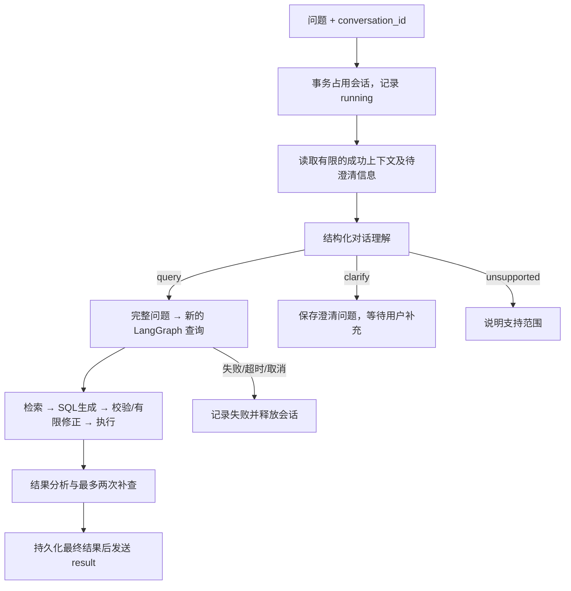

# 多轮问数与会话状态

前端可以连续提问，并把会话保存到后端。点击“新会话”会独立开始，原会话仍在历史列表中；刷新页面会重新读取当前会话。移动端通过顶部下拉框切换历史。

查询执行期间也可以新建或切换会话：A 在后台继续执行，B 可以独立发送问题。历史列表会标出“运行中”，后台完成后显示“有新回复”。切回 A 能看到它持续接收的进度与结果；“停止”只作用于当前显示的会话。各会话的未发送草稿也会分别保留。

这里的“后台”指**当前网页仍打开时切到另一个会话**。刷新、关闭网页或断网仍可能中断原来的 SSE 请求；这次没有新增脱离浏览器连接运行的后台任务队列。

## 如何体验

照原来的方式启动后端和前端即可，无需新增 Docker 服务、安装依赖或执行数据库迁移。已有开发服务如果没有自动重载，请重启。

在同一会话中依次输入：

1. `统计 2025 年第一季度华北地区的销售总额`
2. `那华东呢？`
3. `改成按月份统计，按月份升序`

第二轮应保留时间和指标，只替换地区；第三轮应保留华东筛选并增加月份分组。展开回复中的“本轮查询条件”，可以核对模型补全的问题。新建会话后直接问“那华东呢”，系统应该先询问指标，不继承其他会话。

上述两组场景已使用真实模型验收通过；完整验证范围见下方记录。

## 三层状态的区别

| 层级 | 保存内容 | 生命周期 |
| --- | --- | --- |
| 单轮图状态 `DataAgentState` | 本轮完整问题、召回结果、SQL、修正次数、执行结果 | 每次查询重新创建 |
| 会话状态 | 原始问题、补全问题、指标/时间/维度/筛选、最终结果及状态 | 保存到 SQLite，进程重启后仍在 |
| 前端状态 | 每个会话各自的消息、实时步骤、草稿、连接、运行状态，以及当前选中的会话 | 页面内切换保留；刷新后消息从后端恢复，草稿与连接不持久化；浏览器只保存选中的会话 ID |



`app/agent/conversation.py` 和 `prompts/resolve_conversation.prompt` 负责对话理解。输出经过 Pydantic 验证，包含 `query / clarify / unsupported` 决策、完整问题及 `metrics / time_range / dimensions / filters` 业务上下文。每个有会话 ID 的请求多一次模型调用，包括第一轮，以便处理没有上下文的省略问题。

对话理解使用 JSON 输出模式，并在提示词中提供 JSON Schema、本地使用 Pydantic 校验。这样无需强制工具选择，兼容当前 DeepSeek 思考模式对 `tool_choice` 的限制，相关约束见 [DeepSeek 官方 API 文档](https://api-docs.deepseek.com/api/create-chat-completion/)。格式合法不代表业务含义正确，仍需多轮效果评测。

记忆窗口最多包含最近 3 轮成功查询，以及最后一次成功之后最多 2 轮澄清。不会把历史 SQL、结果表格、失败记录或全量聊天历史塞进下一轮提示词。每轮依然经过完整的检索和 SQL 安全校验。指标等字段由模型提取，属于可检查的业务摘要，并非确定性的语义解析器。

成功查询才成为后续继承的默认依据。澄清会保存原始问题和追问，下一条消息再次进入理解模块；完成查询后旧澄清不再进入记忆。取消、失败、超时、拒绝不会覆盖成功上下文。

## 持久化和并发

默认文件：项目根目录 `data/conversations.sqlite3`，已加入 `.gitignore`。可以通过环境变量 `CONVERSATION_DB_PATH` 指定路径。文件包含查询历史和结果，需要持久化挂载才能在重建容器后保留。

SQLite 操作通过 `asyncio.to_thread` 执行。事务和唯一索引保证共享同一个本地数据库文件的多个进程也不能同时执行同一个会话；不同会话可以独立查询。这里没有给每个会话复用长寿命数据库连接。

前端 `frontend/src/lib/conversationManager.ts` 按稳定的本地会话 key 管理消息和 `AbortController`，后端创建成功后再绑定 `conversation_id`。异步响应只写入发起请求的会话，不会因为用户已经选中 B 就把 A 的回复追加到 B。选中会话仅决定当前展示对象，不触发其他连接取消；同一个会话仍只允许一轮查询运行。列表刷新、历史读取和 SSE 回调分别处理，防止慢返回的旧历史抢回当前选择。

终态有 `completed / clarification / unsupported / error / cancelled`。总查询预算为 120 秒，会话运行租约为 180 秒。正常停止或断开时释放会话；进程异常退出或在刚开始记录时断开留下的占用，会在租约过期后的下次读取/提问时标为中断。过期的旧执行不能再覆盖新状态。刷新后若发现未结束记录，前端会同步状态。

这是**会话持久化与业务上下文恢复**，没有实现 LangGraph checkpoint/interrupt 或从中断节点继续执行。中断的查询需要重新提问。当前文件存储适合本机项目演示，多机部署应迁移到共享数据库并完善任务调度。

## API

- `POST /api/conversations`：创建会话，返回 `id`。
- `GET /api/conversations`：最近 50 个会话。
- `GET /api/conversations/{id}`：最近 100 轮原始消息、状态及结果。
- `POST /api/query`：原接口增加可选的 UUID `conversation_id`。

```json
{
  "query": "那华东呢？",
  "conversation_id": "替换为创建接口返回的 UUID"
}
```

不传 `conversation_id` 时保持单轮行为，不保存会话，也不增加对话理解调用，原来的 Apifox 请求和单轮评测仍可用。问题去掉首尾空白后须为 1–2000 字符。

2026-09-19 起，查询成功后增加[结果分析与有限补查](result-analysis.md)，单轮和多轮请求均适用。`result.analysis` 保存总结、发现、限制和证据，历史恢复时一并展示；旧消息不会自动补算分析。主查询完成但分析不足时，会话可为 `completed`，报告另标 `analysis.status=partial`。下方早期真实验收不代表已经验证新增分析能力。

SSE 新增 `conversation`（会话/轮次 ID）、`context`（补全问题）、`clarification` 和 `unsupported`。`progress / result / error` 仍保留。开始流式响应后的会话占用或不存在错误使用 `error` 事件的 `conversation_busy / conversation_not_found` 错误码；不能只检查 HTTP 200 判断成功。终态先写入数据库，再向前端发出结果。

这些接口与原项目一样面向本地单用户演示。会话 ID 不等于访问权限，当前历史列表没有用户隔离；开放给其他用户前需要认证和会话所有权校验。

## 验证与真实效果的边界

```bash
# 不调用真实模型/外部数据库
python -m unittest discover -s tests -v
python -m app.scripts.evaluate_conversations --check-fixture

# 后端及其依赖服务启动后运行，会调用配置中的模型并产生 API 费用
python -m app.scripts.evaluate_conversations --base-url http://127.0.0.1:8000
```

前端并发回归测试（在 `frontend` 目录执行，不调用模型）：

```bash
node scripts/test.mjs
```

并发改造验证：11 项前端测试通过，覆盖 A/B 事件交错及乱序完成、同会话重复提交拦截、只停止当前会话、异步创建会话返回顺序、历史读取乱序、草稿隔离、后台异常与恢复、后台状态同步和 StrictMode 初始化。后端另新增真实 FastAPI/SSE/SQLite 的内存 HTTP 并发测试，验证 B 先完成时 A 仍在运行，结果分别持久化；后端累计 48 项测试通过。TypeScript 检查和 Vite 构建通过。

浏览器使用真实前端、会话接口与 SQLite，配合模拟慢查询验证 A/B 同时运行、B 先完成而 A 继续执行；A 在后台完成后出现“有新回复”，切回 A 后显示 A 自己的结果且提示消失。测试服务在 `frontend/tests/conversation_fixture.py`，仅用于本机验收，不访问模型或业务数据库。上述并发验证不增加真实模型效果的样本数。

2026-09-16：全部 47 项自动化测试通过，其中新增 18 项会话相关测试，覆盖持久化重读、会话隔离、跨 Store 实例的并发互斥、租约回收、旧执行拒绝提交、记忆窗口、失败不污染、澄清后继续、取消释放、超时、兼容单轮及 API 输入校验；还使用真实 LangChain SDK 配合模拟 HTTP 服务，验证请求采用 JSON 模式且不发送强制工具选择参数。前端 TypeScript 检查与 Vite 构建通过。

`evals/datasets/conversation_smoke.json` 提供 2 个场景共 5 轮真实链路验收，覆盖地区继承、月份分组、新会话隔离、澄清和补充。4 条参考 SQL 已通过离线种子数据检查。运行后报告写入 `evals/reports/conversation-smoke.json`，包括完整问题、结构化上下文、参考/实际结果、耗时、模型和提示词指纹，并核对会话恢复的数据是否一致。

**真实模型验收：2026-09-16，经用户授权，使用 `deepseek-v4-flash` 跑通 2 个场景共 5 轮，5/5 通过。** 四次数据查询均与真实 MySQL 参考 SQL 结果一致；另一次正确返回澄清。每轮保存后重新读取的结果与 SSE 终态一致。

| 场景 / 轮次 | 输入 | 验证结果 | 耗时 |
| --- | --- | --- | --- |
| A / 1 | 2025 年 Q1 华北销售总额 | 41,099.5 | 18.04 秒 |
| A / 2 | 那华东呢？ | 保留时间与指标，地区改为华东；107,373 | 15.66 秒 |
| A / 3 | 改成按月份统计，按月份升序 | 保留华东与 Q1；1–3 月分别为 54,924、17,508、34,941 | 26.24 秒 |
| B / 1 | 新会话：那华东呢？ | 询问指标与时间，未继承 A 的条件 | 1.69 秒 |
| B / 2 | 想看 2025 年第一季度的销售总额 | 合并待澄清的华东条件；107,373 | 15.37 秒 |

首次测试暴露了强制工具选择与 DeepSeek 思考模式不兼容的问题，5 个请求均在对话理解阶段返回 HTTP 400。修复为 JSON 模式、补充真实 SDK 的模拟 HTTP 回归测试后，重跑上述相同用例通过。首次失败记录保留在 `evals/reports/conversation-smoke-tool-choice-failure.json`，修复后报告为 `evals/reports/conversation-smoke.json`；没有把失败记录删掉或计作通过。

这次是小规模真实链路验收，不能写成“多轮问数准确率 100%”。自动化测试中的模型和外部数据源使用替身，也不能代替真实效果评测。路线中的 20 组多轮效果评测仍是后续目标；条件撤销、长对话、复杂指代和相对时间等还需要独立样本验证。
