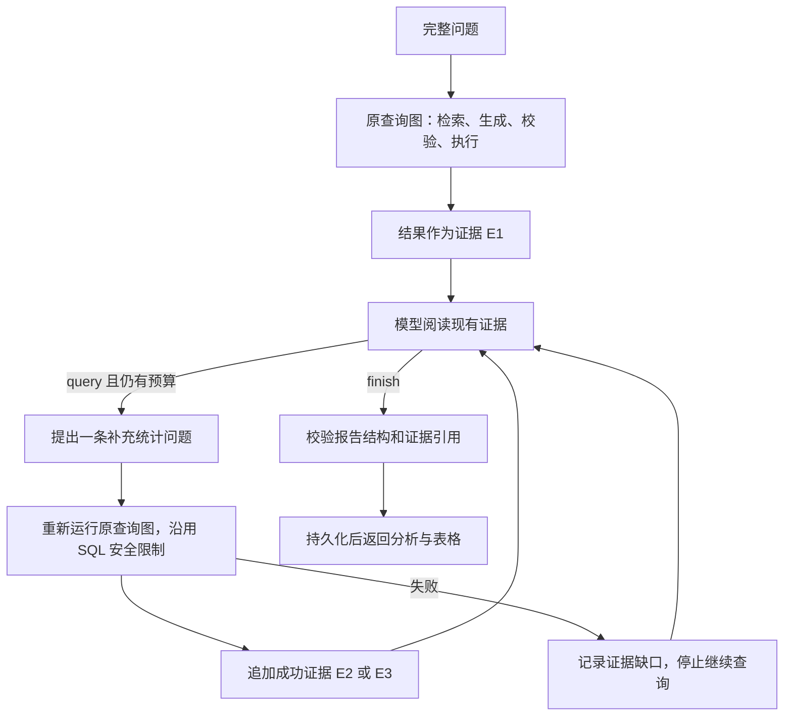

# 查询结果分析与有限补查

原流程在 SQL 执行后直接返回表格。现在 `QueryService` 先完成主查询，再通过 `ResultAnalyzer` 阅读结果、决定是否补查，最后将分析和表格一起返回。普通查数可以直接总结；“为什么下降”需要进一步证据时，模型可以自主提出新的统计问题。

例如重新提问：

> 2025 年华东地区 2 月销售额为什么比 1 月下降？请检查订单数、平均订单金额和品类变化，并说明证据不足的部分。

前端会显示结论、发现、还不能确认的部分，以及可展开的分析依据。每组依据包含实际查询问题、返回数据预览和 SQL。历史会话会恢复同一份报告；旧消息没有分析字段时仍显示原表格，**不会自动重新分析历史回答**。

## 执行方式



- `app/agent/result_analysis.py` 定义 `query / finish` 决策及报告结构，并控制循环；`prompts/analyze_result.prompt` 定义分析要求。
- 每次请求最多主查询 1 次、补查 2 次，最多 3 次分析决策调用。逻辑查询内部仍有原来的 EXPLAIN 检查、最多 2 次 SQL 修正及重验；这些不是额外授权的任意 SQL 工具。
- 补查顺序执行，每次使用新的 LangGraph State，通过完整查询图生成与执行 SQL。不会并行使用同一个请求的 SQLAlchemy AsyncSession。
- 整个请求沿用 120 秒预算；分析阶段最多 75 秒，且不超过本轮剩余时间，预留 2 秒余量。预算用完、补查失败、重复问题或输出不合法时，保留主查询数据并返回 `partial` 分析，无法确认的原因不会标成成功归因。
- 报告引用只能指向实际获得的 `E1 / E2 / E3`。每组数据最多提供前 40 行、约 14,000 字符的预览；截断风险会强制标成部分完成。主查询原始表格仍保留原有最多 200 行的限制。
- 会话的 `completed` 表示主查询完成并保存，分析是否充分另看 `analysis.status`。停止/断连仍按原有方式取消当前请求，不会保存假成功。

结果 SSE 仍只有一个终态 `result`，原来的 `data / sql / max_rows / sql_repair_count` 保留，新增可选字段 `analysis`：

```text
analysis.status: complete | partial
analysis.summary: { text, evidence_ids }
analysis.findings: [{ text, evidence_ids }]
analysis.limitations: string[]
analysis.next_steps: string[]
analysis.evidence: [{ id, question, sql, data, row_count, preview_truncated, possibly_limited }]
analysis.followup_count: 已尝试的补查次数
```

省略 `conversation_id` 的单轮请求也会分析结果，但依旧不读取或保存会话。正常请求至少增加一次分析模型调用；复杂分析最多增加两次完整查询图与三次分析决策调用，延迟及 API 成本会增加。没有新增依赖、数据库迁移或外部服务。开发服务未自动重载时，重启后端并刷新页面即可使用。

## 能力边界

这次补上的是由结果驱动的有限补查与描述性分析，不是完整因果推断，也没有实现底层字段召回不足时的自适应重检索。每次补查内部仍使用现有固定检索图。

销售额、销量和订单数不同：分别对应 `SUM(order_amount)`、`SUM(order_quantity)` 和 `COUNT(DISTINCT order_id)`。分析提示要求补查平均订单金额时显式使用金额除以订单数；这不能替代正式指标语义层。已有 AOV 元数据及已建索引中的依赖/别名问题尚未通过迁移修复，应在后续口径治理中处理。

证据引用校验只保证引用存在，**不保证模型每个数字、语义推断和补查筛选条件都正确**。指标公式、同范围比较、NULL/空值、基期为零、Top N 截断等要求目前主要由提示词约束，需继续用真实模型评测；不能把结构校验称为事实正确性证明。

现有表没有库存、广告投放、流量、活动或数据接入状态。可以定位某品类或订单数的变化，但不能证明“促销结束导致下降”，也不能只根据有订单的日期数宣称数据完整。界面会将限制与建议继续核查的内容单独展示。

## 验证

2026-09-19：63 项后端测试、14 项前端测试通过，TypeScript 检查和 Vite 构建通过。新增覆盖逐次读取新证据、最多两次补查、重复查询拦截、无效引用、部分失败、分析超时、取消释放会话、预览截断，以及实时/历史报告一致和旧记录兼容。

另外使用本机模拟查询服务，在真实前端确认分析正文、发现、限制、证据展开与数据表显示正常；重新打开页面后报告从 SQLite 恢复。验收服务和临时页面已关闭，没有调用真实模型或业务数据库。

这些测试替换了模型和数据查询，不代表真实模型的归因准确率。过去 3 题单轮及 5 轮多轮的真实验收也不覆盖本次分析功能。

真实验收应分别看：

1. 是否保留原问题的时间、地区和指标口径。
2. 两期差额/变化率、订单数与客单价是否与参考 SQL 一致。
3. 品类贡献是否来自对应聚合数据，是否混淆净贡献与毛下降。
4. 无数据、基期为零、截断或失败时是否明确说明限制。
5. 是否编造库存、促销、流量等原因。

现有单轮评测报告会记录 `analysis` 供审阅，但 `passed` 仍只表示 SQL 结果比较通过，不能作为分析正确率。
